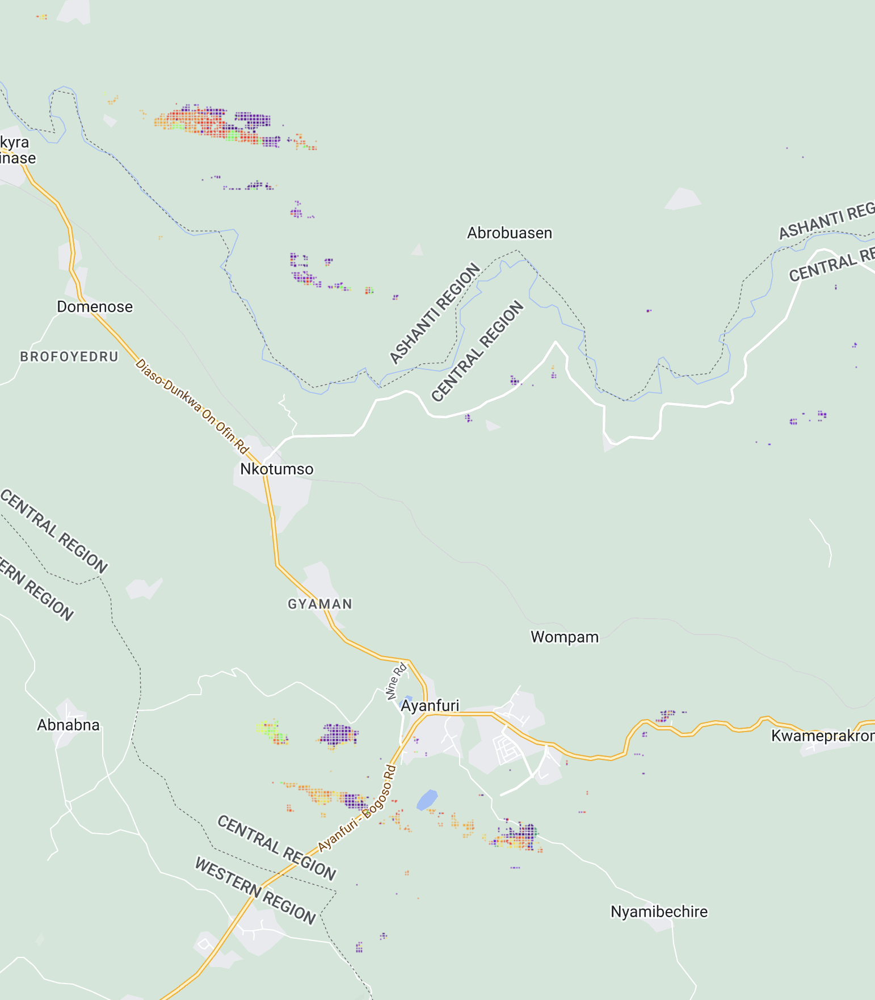
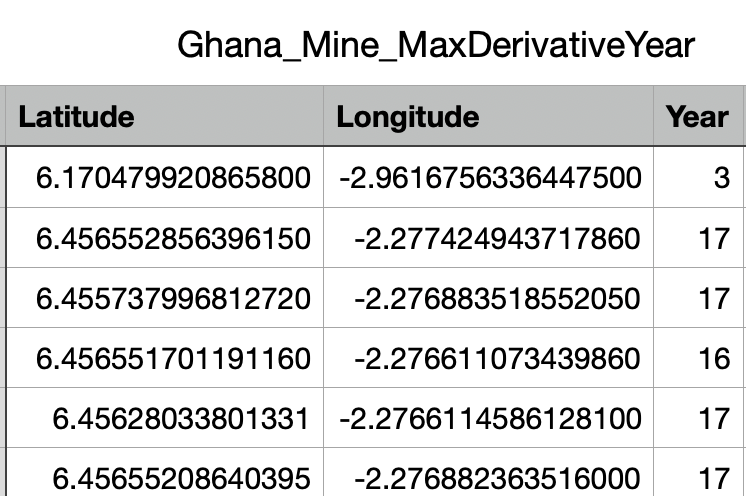

### Time Series Analysis

---

#### Section 1: Workflow

1. **Calculation of Max NVDI Derivative Year:** For each pixels of Ghana, calculate the year with maximum annual NVDI derivative.
2. **Mine Dataset Upload:** Upload our dataset of mine location.
3. **Get the Max NVDI Derivative Year of each Mine:** Since step 1 already calculated the max NVDI derivative year of each pixel in Ghana. This step 3 only needs to get the subset of all mine locations. 

4. **Results Plotting & Export**

---

#### Section 2: Current Result

+ We have two kinds of results: (1) plots on map, (2) CSV
##### Section 2.1. Plots on Map: 
+ This shows the mine locations on map, with color indicating which years have the max NVDI derivative:

  

#### Section 2.2. CSV Files

+ The CSV files is more organized. It records each mine location, as well as the max NVDI derivative years of them:

  

  + Note: **Year** in this file is in an abbreviation format. For instance 17 here means 2017. 